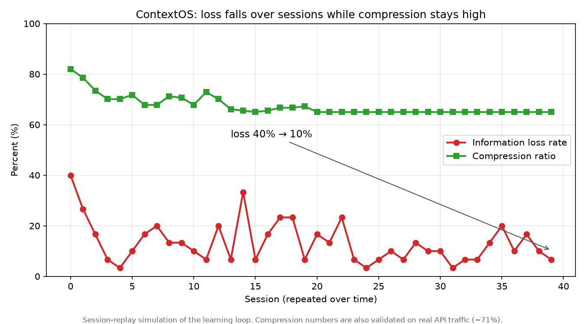

# ContextOS

**A drop-in middleware that compresses LLM-agent context before each API call — and learns to lose less over time.**

Long-running LLM agents resend their entire conversation on every call, so token
cost and latency grow without bound. ContextOS sits between an agent and the model
provider, compresses each request (tool results, duplicate facts, stale history),
forwards the smaller call, and returns the response unchanged. Because it mirrors the
Anthropic Messages API, adoption is a one-line `base_url` change.

What makes it different from a fixed "summarize anything older than N turns" rule:
ContextOS keeps every original recoverable, **detects when a past compression made the
agent re-request something it needed**, and updates its compression policy so it stops
making that mistake — getting *less* lossy over time while staying compressed.

---

## Results

| Metric | Value | How it was measured |
|---|---|---|
| Token reduction on real API traffic | **~71%** | `eval/validate_live.py` — real Anthropic calls; the model's answer on the compressed context preserved every load-bearing fact (exact complexities, benchmark numbers) |
| Token reduction on the offline fixture | **~84%** | `eval/test_pipeline.py` (fake client) |
| Loss rate across repeated sessions | **40% → 10%** while compression held at **~65%** | `benchmarks/loss_over_time.py` — session-replay **simulation** of the learning loop |
| Reversibility | 100% byte-exact recovery of compressed turns | `eval/test_pipeline.py` |

**Honesty note (please read):** the clean *loss-falls-over-time* curve is produced by a
**simulation** that isolates the learning dynamics. On **real agent traffic**
(`benchmarks/live_agent_loop.py`) the full loop — loss detection → policy update →
schema promotion — was observed firing end-to-end and *does* converge, but the path is
noisy because real agent behavior is stochastic and two compression stages learn
independently. The compression numbers above are from real API calls; the smooth
learning curve is simulation-backed. See [What's validated vs simulated](#whats-validated-vs-simulated).



---

## How it works

Two paths run together: a **request path** that compresses each call, and a **learning
loop** that runs across calls and makes the request path less lossy over time.

```
Agent (any framework)
   │   base_url → ContextOS
   ▼
ContextOS  (POST /v1/messages)
   │
   │  REQUEST PATH (per call)
   │   1. ToolResultCompressor   squeeze each tool result (schema extract, else Haiku summary)
   │   2. SemanticDeduplicator   drop near-duplicate facts (embeddings + cosine)
   │   3. SymbolSubstitutor      replace repeated long strings with $S1, $S2, …
   │   4. AdaptiveCompressor     per-turn level (verbatim/bullet/sentence/drop) — asks the policy
   │   5. ContextAssembler       reassemble the final messages
   │
   │  LEARNING LOOP (across calls)
   │   A. FidelityStore     stores every original before compression (loss is reversible)
   │   B. LossDetector      flags re-requests of compressed tool results (a loss event)
   │   C. CompressionPolicy learns from loss events; promotes safe tool schemas
   ▼
Model provider (Anthropic) → response returned to the agent unchanged
```

The two paths connect at Module 4 (which consults the policy) and the learning loop:
every original is written to the FidelityStore before compression, the LossDetector
watches responses for re-requests, and each loss event teaches the policy to protect
that kind of content — and promotes the offending tool's useful fields into a schema so
Module 1 compresses it *deterministically and near-losslessly* from then on.

---

## Quickstart

```bash
# 1. install
pip install -e .

# 2. provide a key (gitignored .env, or export it)
echo 'ANTHROPIC_API_KEY=sk-ant-...' > .env

# 3. run the server
python -m contextos.main        # serves http://localhost:8000
```

Point any Anthropic client at it:

```python
from anthropic import Anthropic
client = Anthropic(base_url="http://localhost:8000")   # the only change
client.messages.create(
    model="claude-sonnet-4-6",
    max_tokens=1000,
    messages=[...],
    extra_headers={"contextos-session-id": "my-session"},  # keys per-session state
)
```

### Endpoints
- `POST /v1/messages` — Anthropic-compatible; compresses, forwards, learns.
- `GET  /v1/stats/{session_id}` — tokens before/after, compression ratio, loss stats.
- `GET  /v1/loss-curve` — loss rate + compression ratio per session (the headline artifact).

---

## Reproduce the results

```bash
pytest eval/                        # request-path correctness + reversibility (offline, no key)
python benchmarks/loss_over_time.py # simulation: loss-vs-sessions curve  → results/summary.txt
python eval/validate_live.py        # REAL API: ~71% compression, faithful answer  (needs key)
python benchmarks/live_agent_loop.py# REAL agent through the HTTP server (needs key)
```

Artifacts land in `results/`.

---

## What's validated vs simulated

| Claim | Status |
|---|---|
| ~71% token compression, faithful answer | ✅ **Real API traffic** (`validate_live.py`) |
| Request-path correctness + 100% reversibility | ✅ Automated tests |
| Learning loop (detect → learn → schema-promote) fires end-to-end | ✅ Observed on **real agent traffic** (`live_agent_loop.py`) |
| Loss falls smoothly over sessions while compression stays high | ⚠️ **Simulation** (`loss_over_time.py`); real-traffic convergence is real but noisy |

---

## Known limitations

- **Real-traffic learning is noisy.** Two compression stages (Module 1 and the adaptive
  compressor) learn independently, and real agents behave stochastically, so the
  loss curve is only clean in simulation. Faster/coordinated protection is future work.
- **Schema learning is top-level + heuristic.** It keeps compact/needle fields and
  drops verbose blobs; important data buried in large nested fields isn't pruned
  intelligently yet.
- **In-memory session state** resets on restart (the learned policy and schemas persist
  to disk; per-session turn history does not). Redis is the production upgrade.
- **English-optimized embeddings** — dedup quality degrades on multilingual content.

---

## Tech stack

FastAPI · Pydantic v2 · Anthropic SDK · tiktoken · sentence-transformers · scikit-learn ·
SQLite (FidelityStore) · pytest. Python 3.11+.

---

## Repo layout

```
contextos/
  main.py            FastAPI app (entry point)
  pipeline.py        orchestrates the request path
  modules/           Modules 1–5 (compressor, deduplicator, substitutor, adaptive, assembler)
  learning/          FidelityStore, LossDetector, CompressionPolicy
  schemas/           models + tool-schema registry
eval/                tests, fixture, live validation
benchmarks/          loss_over_time (simulation) + live_agent_loop (real traffic)
results/             generated metrics + curves
```
